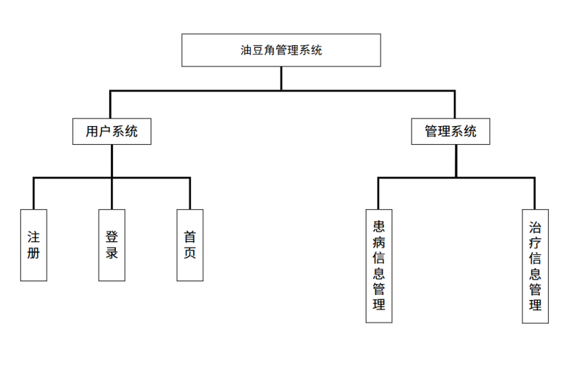
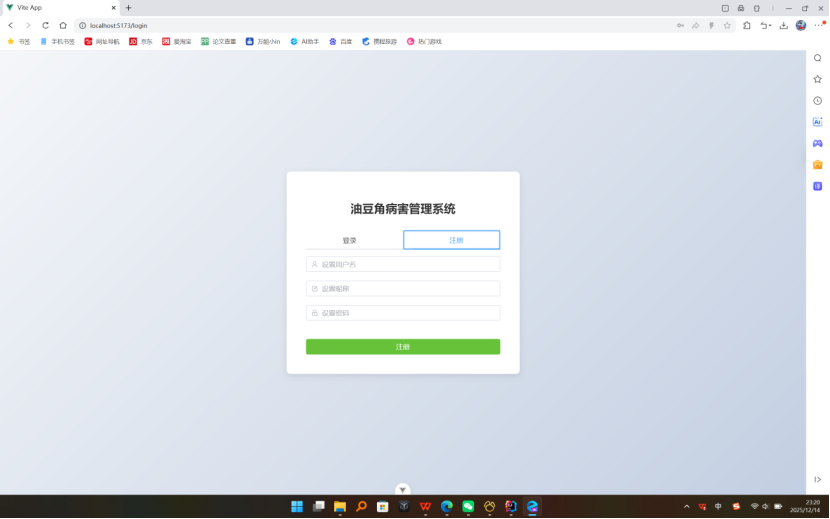
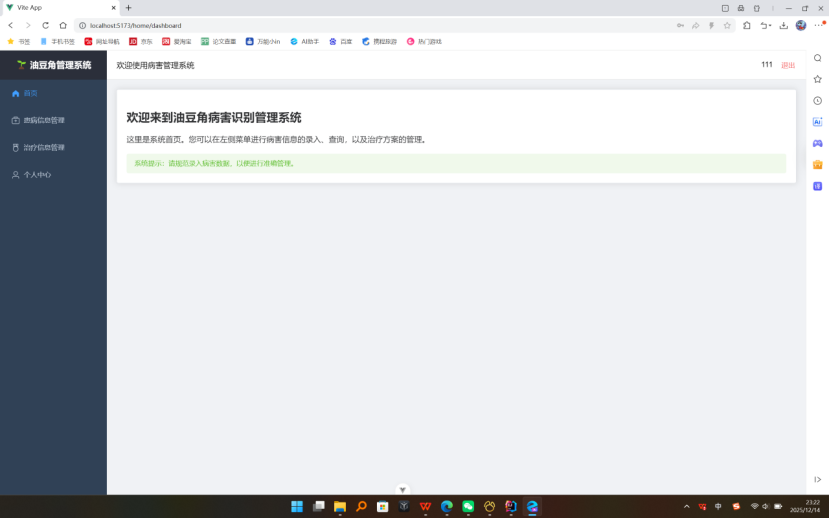
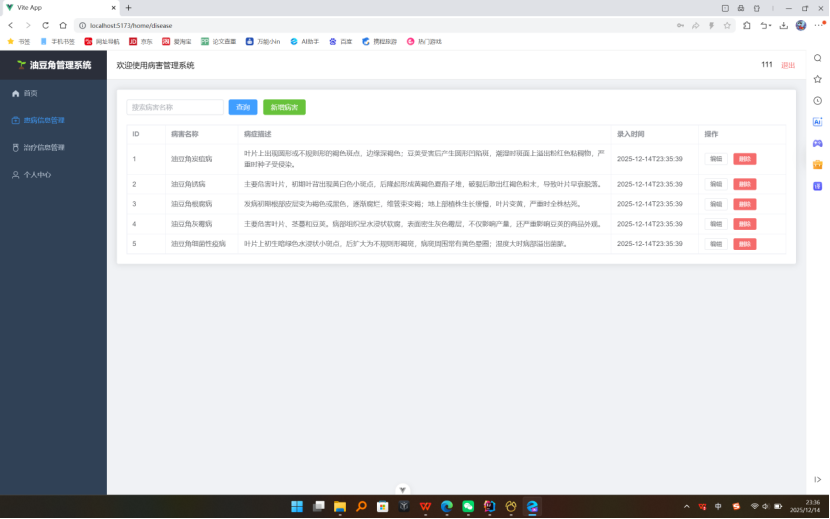
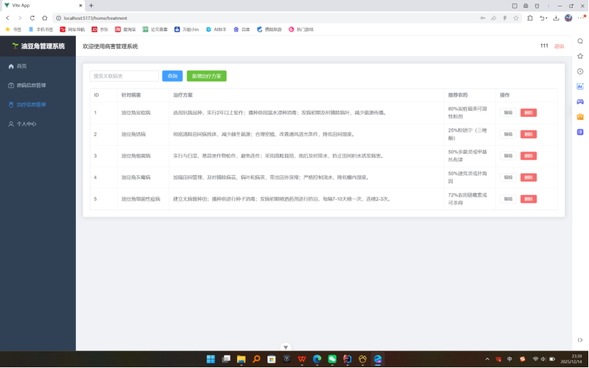
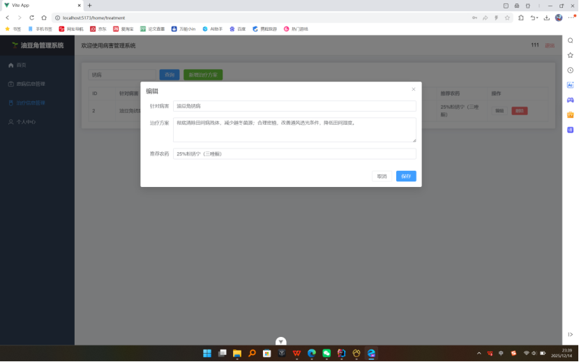

# 油豆角管理系统  V1.0

基于 **Spring Boot + Vue3 + YOLOv8** 构建的油豆角病害智能管理与识别系统，解决传统种植中病害识别滞后、防治记录混乱、专家知识获取难等问题，实现油豆角全周期数字化管理。

------

## 项目简介

油豆角是我国北方（尤其是黑龙江、吉林）特有优质菜豆品种，但**炭疽病、锈病、根腐病、红蜘蛛**等病虫害严重影响产量与品质。

传统方式存在以下问题：

- 病害识别依赖人工经验，准确率低
- 防治记录多为纸质，管理混乱
- 专家知识获取困难，响应滞后

本系统通过 **深度学习 + Web 信息化管理**，实现：

-  治疗方案科学管理
-  多角色数据共享

------

## 系统演示














------

## 运行环境

| 项目     | 详情                    |
| -------- | ----------------------- |
| 操作系统 | Windows / Linux         |
| 后端语言 | Java 17+                |
| 前端语言 | Vue                     |
| 数据库   | MySQL 8.0               |
| 浏览器   | Chrome / Edge / Firefox |

------

## 主要功能

###  用户系统

- 用户注册 / 登录
- 个人中心（修改昵称、密码）
- 多角色支持（普通用户 / 管理员）

### 病害信息管理

- 病害名称、症状描述、图片管理
- 病害信息新增 / 编辑 / 删除
- 按病害名称模糊查询

### 治疗信息管理

- 关联病害的治疗方案
- 推荐农药与施用方法
- 方案新增 / 修改 / 删除

### 智能识别（预留）

- 油豆角病害图像识别
- 自动匹配防治建议
- 专家知识库联动

------

## 项目结构

```text
bean-system/
├── bean-backen/             # Spring Boot 后端
│ ├── common/ # 公共工具类
│ ├── config/ # 配置类
│ ├── controller/ # 控制器层 
│ ├── entity/ # 实体类
│ ├── mapper/ # 数据访问层
│ └── BeanBackenApplication.java # 后端启动入口
├── bean_vue/               # Vue3 前端
│ ├── src/ # 源码目录
│ ├── assets/ # 静态资源
│ ├── components/ # 公共组件
│ ├── router/ # 路由配置
│ ├── views/ # 页面视图
│ ├── App.vue # 根组件
│ └── main.js # 入口文件
└── package.json # 前端依赖配置
└── README.md
```

------

## 使用方式

### 1.克隆项目

```bash
git clone https://github.com/serendipity-sketch/Snap-bean_management.git
```

### 2.后端启动

```bash
cd bean-backen
mvn spring-boot:run
```

### 3.前端启动

```bash
cd bean_vue
npm install
npm run dev
```

